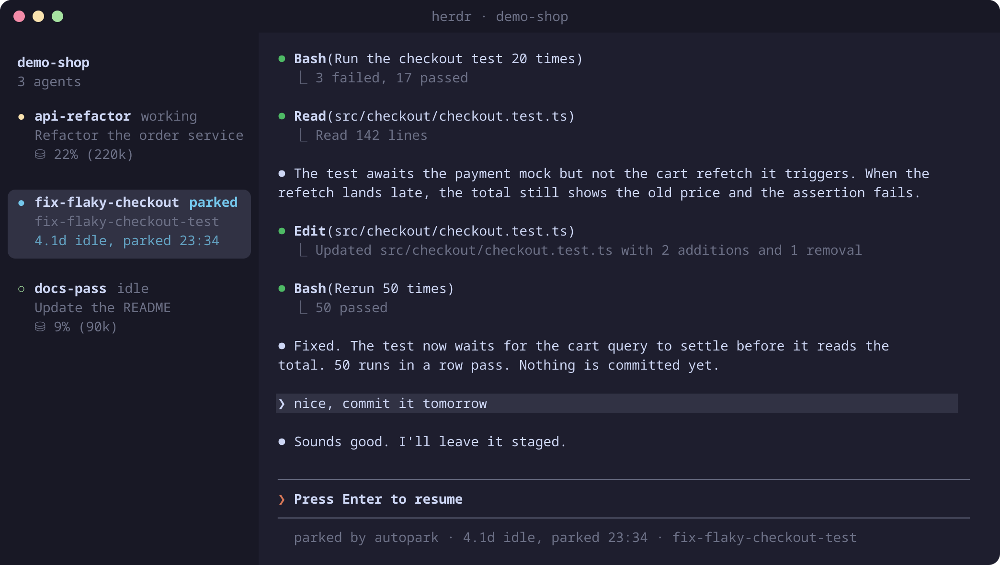

<div align="center">

# Autopark

**Parks idle coding agents to free their RAM. See where you left off and resume in one tap.**

A plugin for [herdr](https://herdr.dev), the terminal workspace for coding agents.

[](https://github.com/common-resources/herdr-autopark/stargazers)
[](LICENSE)




</div>

## Why

RAM is precious nowadays. My agent fleet kept maxing out my 64 GB. If you hoard agents like I do and keep running into the same wall, this plugin might help.

I keep a lot of agent tabs open at once, and most of them are waiting on something, like a PR review or a colleague's email. If I close them, I later have to dig through `claude --resume` or `/resume` to find the right session. With autopark the tabs stay where I put them, and the idle ones stop using memory until I come back.

A Claude Code session with its MCP servers uses 1 to 2 GB, even after sitting idle for days. On my machine autopark parked 12 agents in its first 11 hours. As I write this, 6 of my 9 agent panes are parked, which frees roughly 7 to 11 GB.

Every ten minutes autopark looks for agents that have been quiet for an hour and parks them. The agent process exits, but the pane stays open and keeps showing the conversation. Pressing Enter starts the agent again on the same session, with the same flags, in the same directory.

## Install

```sh
herdr plugin install common-resources/herdr-autopark
herdr plugin action invoke autopark.setup
```

The background loop starts with the herdr server, so restart herdr once after installing. `autopark.setup` creates the config file and shows the two sidebar rows that color parked panes.

To hack on it, clone the repo and use `herdr plugin link <path>`, which runs the plugin from your checkout.

## Supported agents

| Agent | herdr kind | Status | Session history | Resumes with |
| --- | --- | --- | --- | --- |
| [Claude Code](https://claude.com/claude-code) | `claude` | ✅ supported | `~/.claude/projects/*/<session>.jsonl` | `claude <flags> --resume <id>` |
| [Hermes Agent](https://github.com/NousResearch/hermes-agent) | `hermes` | ✅ supported | `~/.hermes/state.db` | `hermes <flags> --resume <id>` |
| [Codex CLI](https://github.com/openai/codex) | `codex` | 🗺️ next | | |
| [OpenCode](https://opencode.ai) | `opencode` | 🗺️ next | | |
| [Gemini CLI](https://github.com/google-gemini/gemini-cli) | `gemini` | 🗺️ next | | |
| [Pi](https://github.com/badlogic/pi-mono) | `pi` | 🗺️ next | | |
| Copilot CLI, Cursor Agent, Amp, Droid, Kimi, Qwen Code, Grok and the other kinds herdr detects | | 💭 later | | |

### How to add support for another agent harness

Each harness is an adapter class in [`bin/harnesses.py`](bin/harnesses.py), registered in the `HARNESSES` map under the agent kind herdr reports. The sweep and the parked view never inspect a harness directly; they go through this interface:

| Member | Contract |
| --- | --- |
| `kind` | The herdr agent kind the adapter handles, for example `codex`. |
| `procs` | Process names (`/proc/<pid>/comm`) that identify the harness under the pane's shell. |
| `session_id(agent, pid, cwd)` | The id of the running session. Prefer herdr's `agent_session` report; fall back to the harness's own state. Return `None` when the answer is ambiguous, and the pane is skipped. |
| `activity(sid, since_epoch)` | A tuple of the last user or assistant message time (epoch seconds) and a list of pending work, such as scheduled jobs or background tasks. Any pending item keeps the session awake. `since_epoch` is the process start; state that dies with the process should be ignored before it. |
| `blocks(sid)` | The conversation as display blocks, oldest first: `('user', text)`, `('assistant', text)`, `('tool', name, arg)`, `('result', first_line)`. Used only when the screen capture is missing. |
| `relaunch(argv, sid)` | The argv that resumes the session, built from the original argv with any existing resume flags removed. |

An adapter is ready to merge when:

1. It reads session state from the harness's own files or database, read-only.
2. `activity` reports every kind of work that stops when the process exits, so such sessions are never parked.
3. `bin/test_autopark.py` covers `relaunch` and `activity` with fixture data.
4. A real park and resume has been done in herdr: the parked view shows the conversation, and Enter brings back the same session with the original flags.

The agents marked "next" in the table are the priority. Pull requests are welcome, and so are issues that name a harness you would use this with.

## What you get

- A still view of the conversation. Right before parking, autopark captures the agent's own screen and replays it in the pane, with a prompt box at the bottom. If the capture fails, it draws the conversation from the session history instead. It has no scrollback, and the wheel and arrow keys do nothing, so a stray scroll can't write into it.
- It stays in the sidebar. Parked panes keep their place, tagged `parked` and colored, with a note such as `4.1d idle, parked 23:34`.
- Resume with Enter. The agent comes back on the same session with the flags you started it with. Ctrl+C drops to a plain shell instead.
- A strict idea of idle. If anything suggests the agent is still busy, it is left alone (see below).
- Settings live in one file and apply on the next check.

## Configure

```sh
herdr plugin action invoke autopark.config   # opens the config in $EDITOR
```

| Key | Default | What it does |
| --- | --- | --- |
| `idle_minutes` | `60` | Park after this long without a message or subagent activity |
| `interval_minutes` | `10` | How often to check |
| `resume_grace_minutes` | same as `idle_minutes` | After you resume a pane, keep it awake at least this long |
| `exclude` | `[]` | Session ids or pane ids never to park |
| `extra_benign_children` | `[]` | Regexes for more child processes that are idle servers, not work |
| `stop_idle_subagents` | `true` | When Claude asks to confirm exit because background subagents are open, stop them if every one is a subagent; anything else (a shell, a workflow) cancels the park |
| `show_transcript` | `true` | Set `false` for a one-line banner instead of the captured screen |
| `dry_run` | `false` | Log what would be parked, park nothing |

The file lives in `herdr plugin config-dir autopark`. [`config.example.toml`](config.example.toml) has every key with a comment.

### Sidebar colors

A plugin can't edit your herdr config, so add these to `[ui.sidebar.agents] rows` in `~/.config/herdr/config.toml`, then run `herdr server reload-config`:

```toml
["state_icon", "tab", { token = "state_text", rules = [{ equals = "parked", fg = "#74c7ec", bold = true }] }],
[{ token = "$parked", fg = "#74c7ec", dim = true }],
```

## Actions

| Action | What it does |
| --- | --- |
| `autopark.setup` | Creates the config file and shows the sidebar rows |
| `autopark.config` | Opens the config in `$EDITOR` |
| `autopark.preview` | Lists every agent and why it would or would not be parked |
| `autopark.park-now` | Runs a check now instead of waiting for the next one |

Bind any of them to a key with a `[[keys.command]]` entry of `type = "plugin_action"`.

## When an agent counts as idle

Autopark reads the timestamp of the last message from you or the agent in its own session history. Restarting herdr or the agent resets herdr's idle timer, but that timestamp stays the same, so an agent that was idle before a restart is still idle after it.

It parks an agent only when all of these are true:

- herdr reports it idle or done, and you're not focused on it
- nothing was said, and no subagent or workflow file changed, within `idle_minutes`
- nothing is pending: for Claude a `/loop` wakeup, cron job, monitor or subagent; for Hermes a delegated task or background process. Claude's cron jobs live only in the running process, so parking would cancel them: a session keeps every recurring job until it is deleted or reaches Claude's 7-day expiry, and every one-shot job until its time has passed
- the agent has no child process other than its own MCP and language servers, so a shell, dev server or test run keeps it awake
- the input box has no unsent draft
- you didn't resume it from a park within `resume_grace_minutes`

Every check runs again right before `/exit` is sent. If Claude asks to confirm exit and only idle subagents are listed, autopark picks "Exit and stop tasks"; otherwise it cancels and waits for new activity before trying again. If the agent is still alive 30 seconds after `/exit`, the pane is left alone.

To see what it's doing, look at `log` in the plugin state directory (`~/.local/state/herdr/plugins/autopark/` by default), or run `autopark.preview`.

## Roadmap

These are planned, roughly in order. None of them are built yet.

**macOS**

- [ ] Replace the `/proc` reads (finding the agent process, its children, working directory and start time) with `ps` and `lsof`
- [ ] Declare `macos` in the plugin manifest once a real park and resume has been tested on a Mac

**More agents**

- [ ] Codex, OpenCode, Gemini CLI and Pi adapters (see the table above)

**Quality of life**

- [ ] Show how much memory each park freed, in the log and in the parked pane's note (`1.9 GB freed`)
- [ ] `autopark.resume-all` action, and `autopark.park` to park the focused pane right away
- [ ] Optionally resume when the pane gets focus, instead of waiting for Enter
- [ ] Per-workspace idle thresholds, so a scratch workspace can park sooner than the main one
- [ ] Redraw from the session history when the pane is resized to a very different size, instead of cropping the capture
- [ ] Optional herdr toast when something is parked
- [ ] Cap how long subagents can keep an agent awake (`max_subagent_minutes`): past it, park anyway and stop them through the exit dialog, and show the open subagents in `autopark.preview`

**Upkeep**

- [ ] Warn in `autopark.setup` when an agent's herdr integration is missing, since that is where the session id and state come from

## Development

```sh
make check   # ruff, shellcheck, shfmt and the self-check; this is what CI runs
make fmt     # apply ruff and shfmt fixes
```

The only requirement is [uv](https://docs.astral.sh/uv/). The linters run through `uvx`, and the self-check (`bin/test_autopark.py`) is plain Python that also runs under pytest.

## Like it?

If Autopark saved you a few gigabytes, please [star the repo](https://github.com/common-resources/herdr-autopark) ⭐. Stars help other herdr users find it in the plugin marketplace, and they tell me it's worth adding more (macOS support, more agents). Issues and pull requests are welcome too.

<a href="https://star-history.com/#common-resources/herdr-autopark&Date">
  <picture>
    <source media="(prefers-color-scheme: dark)" srcset="https://api.star-history.com/svg?repos=common-resources/herdr-autopark&type=Date&theme=dark" />
    
  </picture>
</a>

## License

[MIT](LICENSE) © 2026 Johannes Krauser
